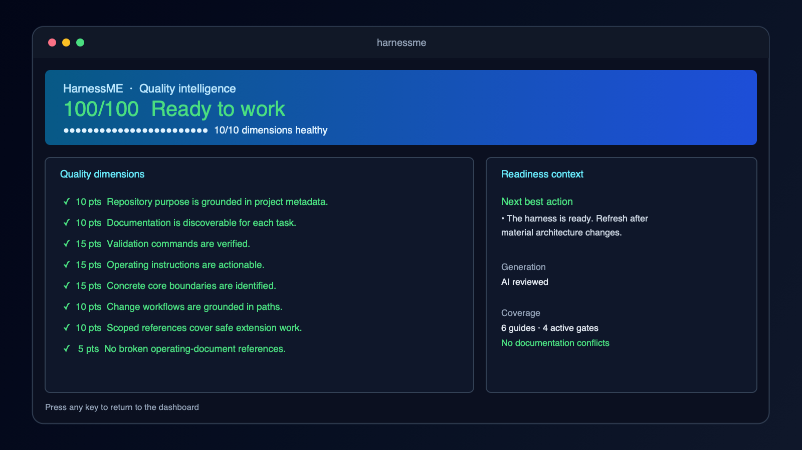

<p align="center">
  
</p>

<h1 align="center">HarnessME</h1>

<p align="center">
  Turn a repository into a safe, specific operating contract for AI coding agents.
</p>

HarnessME reads the structure and conventions that already exist in a repository, then produces a maintained `AGENTS.md`, scoped module guides, and agent-specific integrations. It tells agents where to make changes, what must remain true, how to validate their work, and when they must ask a developer before touching a core area.

## Why HarnessME?

Generic instructions make an agent guess. HarnessME makes the repository legible: it grounds guidance in real files and validation commands, highlights coupled changes, detects documentation drift, and protects high-impact paths with an explicit human gate. It is a local, scriptable CLI—no hosted service or HarnessME account required.

## Quick start

Requires Node.js 26.4 or newer on Windows, macOS, or Linux.

```bash
npm install -g harnessme
cd your-repository
harnessme init
```

`init` selects an available signed-in AI framework, lets you choose a model, analyzes the repository, and writes the harness. Run `harnessme` with no subcommand afterward to open the dashboard.

<p align="center">
  
  <br>
  <em>The terminal dashboard turns quality checks into an actionable readiness view.</em>
</p>

## What you get

- A concise root `AGENTS.md` that directs agents before they edit.
- Nested module guides with responsibilities, extension seams, invariants, coupled-change impact, and exact validation.
- `.harnessme/CRITICAL.md` and enforceable gates for core, security, persistence, billing, deployment, and public-contract changes.
- Provider files for Codex, Claude Code, Cursor, and other selected agent formats.
- A dashboard and `harnessme quality` scorecard that show what is healthy, what is missing, and the next best action.

## Install

Requires Node.js 26.4 or newer on Windows, macOS, or Linux. The dashboard automatically enables Node's experimental FFI flag required by OpenTUI.

```bash
npm install -g harnessme
harnessme --version
```

After this, run every command directly as `harnessme …` from the repository you want to analyze.

For model-assisted generation, install and sign in to at least one supported framework CLI: Codex, Claude Code, or Cursor. Use `--deterministic` when you want a fully local run without model inference.


## Use

Run `harnessme` without a subcommand to open the full-screen terminal dashboard. It shows the current mode, provider, model, thinking level, quality score, gate counts, scoped-guide count, and a live preview of `AGENTS.md`. The **Quality report** opens a focused scorecard for every quality dimension, readiness context, and the next best action when something needs attention. Use the dashboard to initialize or refresh the harness, switch inference provider/model, synchronize integrations, or remove HarnessME state. Guided initialization selects provider, model, optional Codex thinking level, review depth, optional project context, and confirms the resulting plan before writing; refresh also offers an optional context field. Long-running operations show their current phase and a live output panel. Use the context field for domain rules, architecture constraints, team practices, or known risks that code cannot reveal. The Critical Gate Manager provides checkbox-style selection for multiple paths, bulk activation/removal, and a three-step form for adding a custom protected path. Arrow keys navigate, Enter or Space toggles a gate, `a` selects all, `s` applies a gate plan, `n` adds a gate, and Escape or `q` exits.

Initialize HarnessME from the root of an existing repository:

```bash
harnessme init
```

By default, `init` resolves the first available signed-in inference CLI and writes integrations for every supported agent framework. In an interactive terminal it then lists the provider's available models and asks you to select one; `--model` makes that choice non-interactively. If no supported AI CLI is available, `auto` stops with a clear error; use `--deterministic` only when you explicitly want local-only generation. The CLI prints `✓` or `✗` status lines showing the effective AI, review, and deterministic modes. The `--provider` option selects inference; it does not limit generated files. Use `--targets codex,claude-code` only when you intentionally want a smaller output set.

This creates the facts store in `.harnessme/`, a concise root `AGENTS.md`, a navigable architecture and critical-change agent pack under `.harnessme/agent-pack/`, concern guides under `.harnessme/references/`, and detailed nested `AGENTS.md` files beside the modules they govern. It also creates provider files, a harness-quality report, CODEOWNERS, CI configuration, and a cross-platform Lefthook configuration. Run `harnessme hooks install` afterward when you want to activate the local Git gate.

Long-running commands display a phase-by-phase progress bar describing the current operation. When output is redirected or running in CI, the same updates are emitted as stable `progress:` log lines.

<details>
<summary><strong>How HarnessME creates and reviews the harness</strong></summary>

## How the harness is created

When `harnessme init` runs, it:

1. Scans supported source files with bundled syntax-tree grammars and reads repository configuration and documentation.
2. Reads package metadata, formatter and linter settings, type configuration, contribution documentation, and Git history.
3. Detects the project purpose, repository structure, coding conventions, domain invariants, module ownership, validation commands, import hubs, frequently changed files, and documentation references that no longer match the implementation.
4. Stores those findings in `.harnessme/facts/`. Every inferred convention includes a repository-relative file and line citation.
5. Builds a deterministic `AGENTS.md` baseline and a bounded list of possible critical files and modules.
6. Uses a four-stage model pipeline when AI is enabled: evidence extraction, independent claim verification, harness/reference authorship, and final baseline comparison. The author and reviewers receive the same bounded, redacted repository context; it is never stored. The review council validates every candidate and selects the strongest valid result based on concrete paths, symbols, citations, workflows, and scoped coverage. A focused repair pass runs only when local validation rejects every candidate.
7. Authors a concise repository-specific root `AGENTS.md`, a dedicated agent pack with architecture routing and a critical-change audit standard, and concern-focused executable change manuals. Each scoped guide identifies responsibilities, supported extension seams, invariants, coupled change impact, anti-patterns, workflows, validation, and maintenance triggers. HarnessME then places detailed nested `AGENTS.md` operating contracts in the applicable module directories. Cross-cutting guides can cover multiple concrete scopes. Obsolete managed module guides are removed on refresh.
8. Classifies proposed gates as security, persistence, public-contract, billing, deployment, shared-core, or other; only reviewer-approved paths from deterministic candidates can become active.
9. Scores the resulting harness for purpose, documentation, validation, evidence, operating rules, core boundaries, workflows, scoped references, and documentation consistency.
10. Enforces safety language and managed placeholders locally, distributes the result to every selected framework, and generates `.harnessme/CRITICAL.md`, CODEOWNERS, a Claude Code hook when selected, Lefthook configuration, and a GitHub Actions workflow.

Existing unmanaged `AGENTS.md` instructions are preserved as project directives instead of being discarded. Application source files are analyzed but not rewritten.

### Framework model inference and fallback

Model-assisted generation reuses the authentication from Codex, Claude Code, or Cursor. Choose the runtime with `--provider`; `auto` resolves the first installed supported CLI:

```text
harnessme init --provider auto
```

When run in a terminal without `--model`, HarnessME asks you to select a model after resolving the provider. Codex and Cursor expose their available model catalogs; providers that cannot enumerate models offer their configured default or a manually entered model ID. Codex also offers `Fast`, `Balanced`, and `Deep` thinking levels, which map to its native reasoning-effort setting. For scripts and CI, set that choice explicitly with `--thinking-level low|medium|high` (Codex only):

```text
harnessme init --provider codex --model your-model --thinking-level high
```

Supported inference runtimes are `codex`, `claude-code`, and `cursor`. HarnessME runs them non-interactively in an isolated temporary directory containing only bounded, redacted analysis input—not the repository itself. Input selection prioritizes the root README, architecture/policy documents, manifests, and a balanced sample of core source from each module. The model first enriches deterministic findings with structured, evidence-cited facts. It then authors the full `AGENTS.md` and scoped change manuals from verified facts, the deterministic baseline, and that same audited context. Existing repository documentation is used through progressive disclosure: the root contract routes agents to task-relevant documents and states when those documents must change with the code instead of duplicating them. Independent review candidates compare and edit the harness before HarnessME selects the deepest valid candidate and validates pre-edit guidance, actionable operating rules and workflows, concrete core boundaries, extension seams, coupled changes, anti-patterns, documentation routing, exact validation commands, safety language, managed placeholders, and chosen gate paths. Inventory-style output such as language percentages is rejected. AI mode never substitutes a deterministic document: it retries validation repairs up to three times and then fails clearly, leaving no newly rendered fallback harness. Use `--deterministic` only when local-only generation is explicitly intended.

For a second opinion, assign a separate reviewer with `--review-provider`. The reviewer verifies proposed facts before storage, then receives the redacted validated evidence bundle, deterministic baseline, and draft for the final comparison. A different provider is recommended when available:

```text
harnessme init --provider codex --review-provider claude-code
```

Without `--review-provider`, the selected runtime performs a separate review call. With it, both fact verification and final-document comparison use the independent reviewer. AI may activate a critical gate only for a concrete file or module discovered by deterministic analysis; the local Git-content approval mechanism remains deterministic and still requires an authorized human reviewer.

An OpenAI-compatible endpoint, including a local Ollama server, remains available when no framework CLI is suitable:

```text
harnessme init --provider http --ai-endpoint http://localhost:11434/v1/chat/completions --model qwen2.5-coder:7b
```

For an authenticated endpoint, add `--ai-api-key-env AI_API_KEY`. The reviewer endpoint equivalents are `--review-ai-endpoint`, `--review-model`, and `--review-ai-api-key-env`. Model inference examines text-like source files within configured size limits. Git-ignored files, common credential paths, `.harnessmeignore` entries, secret-like lines, and prompt-injection-like lines are excluded or redacted before inference. Proposed facts must pass schema validation, local file-and-line citation checks, and model verification before entering the facts store. The audit at `.harnessme/facts/ai-inputs.json` records paths, byte counts, and redaction counts—never file contents.

The reviewed AI template is stored at `.harnessme/facts/AGENTS.authored.md`; scoped documents are stored in `.harnessme/facts/references.json` and rendered under `.harnessme/references/`. The generated `.harnessme/agent-pack/architecture.md` routes agents to the smallest applicable guide, while `critical-change-audit.md` defines the required audit record for confirmed protected edits. `.harnessme/facts/harness-generation.json` records the author/reviewer runtimes, models, comparison summary, and activated gates. `.harnessme/facts/conflicts.json` reports documentation paths that disagree with the repository, while `.harnessme/facts/quality.json` records the scored quality checks. HarnessME owns the critical-path, directives, verified-changes, and pending-note placeholders so later governance commands can update them without discarding maintainer content.

Preview exactly which files would be included without contacting a model or writing the harness:

```text
harnessme init --ai-preview
```

Use `--ai-include "src/**"`, `--ai-exclude "src/generated/**"`, or add patterns to `.harnessmeignore` for finer control. Use `--deterministic` to disable model inference for offline or privacy-sensitive runs.

After the repository changes, run `harnessme refresh`. It reuses the provider, model, privacy filters, and reviewer stored during initialization, preserves maintainer directives, approved critical records, verified changes, and pending notes, and rewrites only HarnessME-managed guidance. Pass `--deterministic` for an offline refresh.

</details>

## Everyday commands

```bash
harnessme                  # open the interactive dashboard
harnessme refresh          # update the harness after repository changes
harnessme quality          # see quality dimensions and next best action
harnessme check --ci       # fail CI when facts have drifted
```

<details>
<summary><strong>Full command reference and critical-change workflow</strong></summary>

## Command reference

Commands that operate on a repository accept `--root <path>` to operate on another repository root. Use `harnessme --help` for built-in help and `harnessme --version` to print the installed version.

| Command | Purpose | Options |
| --- | --- | --- |
| `harnessme init` | Analyze a repository and create the harness. | `--provider auto|codex|claude-code|cursor|http`, `--review-provider …`, `--targets <comma-list>`, `--model <name>`, `--thinking-level low|medium|high` (Codex), `--review-model <name>`, `--ai-endpoint <url>`, `--review-ai-endpoint <url>`, `--ai-api-key-env <env>`, `--review-ai-api-key-env <env>`, `--ai-include <comma-list>`, `--ai-exclude <comma-list>`, `--ai-preview`, `--deterministic`, `--critical-approvers <comma-list>`, `--details <text>` |
| `harnessme scan` | Report analysis drift without writing. | No command-specific options. |
| `harnessme refresh` | Reanalyze and rewrite generated guidance while preserving directives, approvals, verified changes, and pending notes. | `--deterministic`, `--details <text>` |
| `harnessme sync` | Regenerate generated agent files from validated facts. | `--targets <comma-list>` |
| `harnessme quality` | Score the harness and list missing operational guidance or documentation conflicts. | No command-specific options. |
| `harnessme validate` | Validate pending agent notes and refresh facts. | `--max-retries <non-negative integer>`, `--ci` |
| `harnessme check` | Fail if committed facts have drifted. | `--ci` |
| `harnessme directive add <text>` | Add a maintainer-authored instruction. | — |
| `harnessme directive list` | Print maintained directives. | — |
| `harnessme critical add <glob>` | Register a risk-classified critical path. | `--reason <text>` and `--approvers <comma-list>` are required; `--risk security|persistence|public-contract|billing|deployment|shared-core|other` overrides automatic classification. |
| `harnessme critical list` | List critical-path rules. | — |
| `harnessme critical activate <glob>` | Activate a proposed critical path and regenerate governance files. | — |
| `harnessme critical remove <glob>` | Remove an active or proposed critical-path rule and regenerate governance files. | — |
| `harnessme critical draft <path>` | Start a review record before changing a critical file. | `--summary <text>` is required. |
| `harnessme critical approve <record.md>` | Bind an approved record to staged content. | `--approver <handle>` is required. |
| `harnessme critical-gate` | Run the critical-path gate (normally invoked by hooks/CI). | `--path <file>` for edit checks, `--base <git-revision>` for CI, or `--hook` for Claude Code hook input. |
| `harnessme hooks install` | Install the generated cross-platform Git pre-commit gate. | — |
| `harnessme hooks status` | Report whether the local gate is installed. | — |
| `harnessme providers list` | List selectable inference providers. | — |
| `harnessme targets list` | List generated integration targets. | — |

`--provider` and `--review-provider` select inference runtimes. `--targets` selects generated instruction formats; the two settings are intentionally independent. The HTTP provider requires `--ai-endpoint` and `--model`; HTTP review requires `--review-ai-endpoint` and `--review-model`.

Keep the harness current:

```bash
harnessme scan                 # report differences without writing
harnessme refresh              # reanalyze and update the operating contract and scoped references
harnessme quality              # show the harness quality score and missing guidance
harnessme validate             # verify pending notes from AGENTS.md
harnessme sync                 # regenerate provider files
harnessme check --ci           # fail when facts have drifted
```

Add a project policy that cannot be inferred from source code:

```bash
harnessme directive add "Use OAuth2 for authentication"
```

Protect a critical area:

```bash
harnessme critical add "src/payments/**" --reason "money movement" --approvers "alice,bob"
harnessme critical draft "src/payments/refund.ts" --summary "support partial refunds"
# A listed human reviewer reviews the record and staged code, then:
harnessme critical approve <record.md> --approver alice
git add .harnessme/critical-log/<record.md> .harnessme/CRITICAL.md
```

In deterministic-only mode, heuristic paths begin as `proposed`. Review them first, then activate an accepted rule. In AI mode, the final comparison may activate evidence-backed core paths automatically and records them with source `ai-reviewed`:

```bash
harnessme critical list
harnessme critical activate "src/core.ts"
harnessme critical remove "src/core.ts"
```

For registered paths, generated agent instructions require explicit developer confirmation before editing. Claude Code receives a native permission prompt; the Git hook and CI reject commits unless an approved record matches the exact staged/committed content and ships with the updated critical index. CODEOWNERS remains the authoritative team-review control on GitHub.

</details>

## Behind the scenes

- `web-tree-sitter` and VS Code WASM grammars for deterministic multi-language analysis
- `OpenTUI` for the cross-platform full-screen terminal dashboard
- `zod` for validating the version-controlled facts store
- `Ruler` for distributing instructions to agent-specific formats
- `js-yaml`, TOML, and frontmatter parsing for project configuration and critical-change records
- Git history for hotspot detection and git-native critical-path checks
- Import-graph fan-in and AST patterns for core-module and architecture detection
- Authenticated Codex, Claude Code, or Cursor CLI sessions for optional model-assisted harness inference
- Full AI authorship plus a separate baseline-comparison and correction pass for `AGENTS.md`
- Claude Code hooks, Lefthook, GitHub Actions, and CODEOWNERS for governance backstops
- Explicit labels distinguishing observed, AI-assisted, maintainer-authored, proposed, and active guidance


## Development

```bash
npm install
npm run lint
npm test
npm run test:package
```

## Publishing

Releases are published through `.github/workflows/release.yml` using npm trusted publishing and provenance. Before the first automated release, configure this GitHub repository and the `release.yml` workflow as a trusted publisher in the npm package settings, enable two-factor authentication on maintainer accounts, and create the protected GitHub environment named `npm`.

Set the version in `package.json`, commit it, create a matching tag such as `v0.4.0`, and publish a GitHub Release from that tag. The workflow rejects a tag that does not match the package version, runs the full test and packaged-install suite, then publishes with provenance.


## License

MIT
